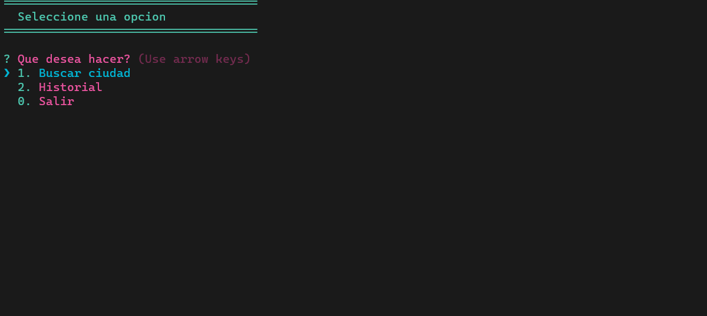

<div align="center" id="top"> 
  

  &#xa0;

  <!-- <a href="https://app-clima-consola.netlify.app">Demo</a> -->
</div>

<h1 align="center">Aplicación Nodejs del clima</h1>

<p align="center">
  

  

  

  

  <!--  -->

  <!--  -->

  <!--  -->
</p>

<!-- Status -->

<!-- <h4 align="center"> 
	🚧  app-clima-consola 🚀 Under construction...  🚧
</h4> 

<hr> -->

<!-- <p align="center">
  <a href="#dart-about">About</a> &#xa0; | &#xa0; 
  <a href="#sparkles-features">Features</a> &#xa0; | &#xa0;
  <a href="#rocket-technologies">Technologies</a> &#xa0; | &#xa0;
  <a href="#white_check_mark-requirements">Requirements</a> &#xa0; | &#xa0;
  <a href="#checkered_flag-starting">Starting</a> &#xa0; | &#xa0;
  <a href="#memo-license">License</a> &#xa0; | &#xa0;
  <a href="https://github.com/ivanmercedes" target="_blank">Author</a>
</p> -->

<br>

## :dart: Sobre el proyecto ##

Es una aplicación que obtiene la información del clima mediante el nombre del país, ciudad o lugar utilizando las API OpenWeather y MapBox

<!-- ## :sparkles: Features ##

:heavy_check_mark: Feature 1;\
:heavy_check_mark: Feature 2;\
:heavy_check_mark: Feature 3; -->

## :rocket: Tecnologias ##

En este proyecto se utilizaron las siguientes herramientas:

- [Node.js](https://nodejs.org/es/)
- [OpenWeather Api](https://openweathermap.org/api)
- [MapBox Api](https://www.mapbox.com/)

## :white_check_mark: Requisitos ##

Antes de comenzar :checkered_flag: , debe tener [Git](https://git-scm.com) y [Node](https://nodejs.org/en/) instalados.

## :checkered_flag: Empezar ##

```bash
# Clonar el proyecto
$ git clone https://github.com/ivanmercedes/app-clima-consola

# Entrar en el directorio
$ cd app-clima-consola

# Instalar las dependecias 
$ npm i

# Configurar los API key en el .env ( Ver archivo de ejemplo )
$ MAPBOX_KEY
$ OPENWEATHER_KEY

# Iniciar el proyecto
$ npm start

```

## :memo: Licencia ##

This project is under license from MIT. For more details, see the [LICENSE](LICENSE.md) file.


Made with :heart: by <a href="https://github.com/ivanmercedes" target="_blank">Ivan Mercedes</a>

&#xa0;

<a href="#top">Volver arriba</a>
